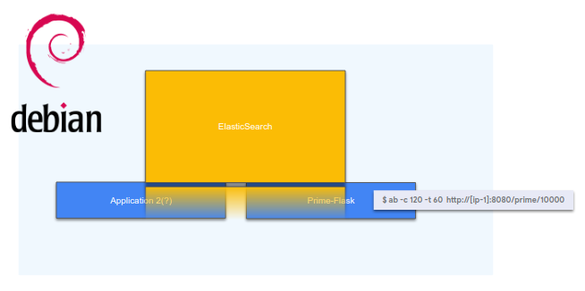
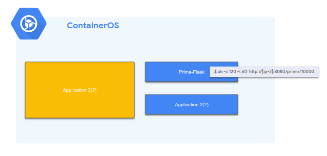
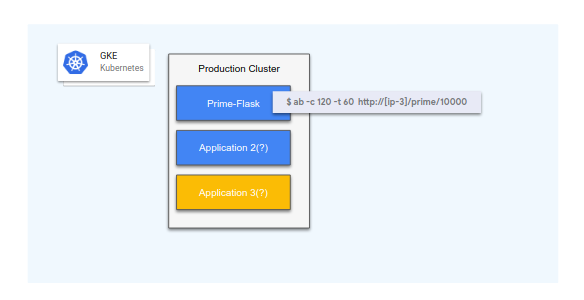
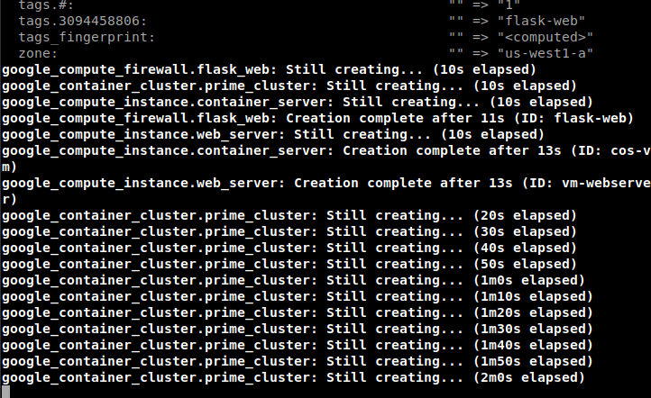
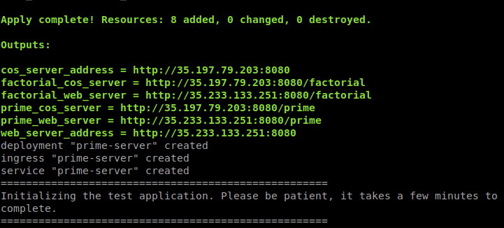
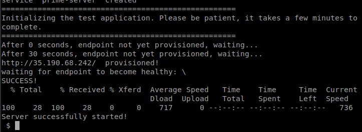
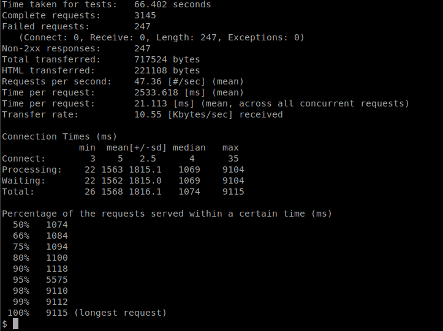
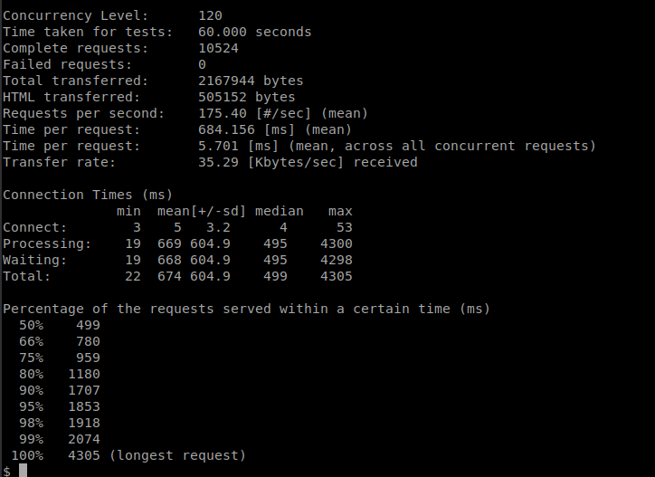
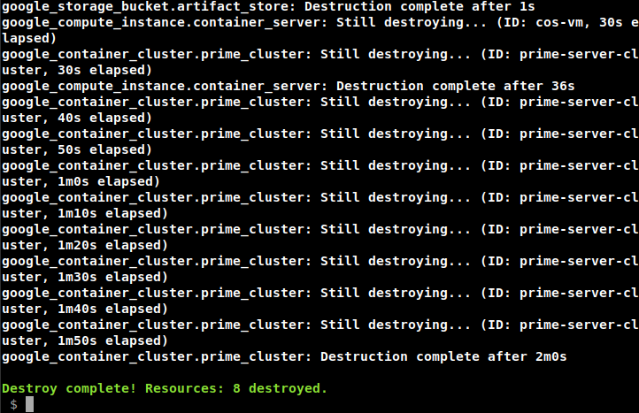

# Migrating to Containers

Containers are quickly becoming an industry standard for deployment of software applications. The business and technological advantages of containerizing workloads are driving many teams towards moving their applications to containers. This demo provides a basic walkthrough of migrating a stateless application from running on a VM to running on [Kubernetes Engine (GKE)](https://cloud.google.com/kubernetes-engine/). It demonstrates the lifecycle of an application transitioning from a typical VM/OS-based deployment to three different containerized cloud infrastructure platforms.

## Table of Contents
<!-- TOC -->
* [Introduction](#introduction)
* [Architecture](#architecture)
* [Prerequisites](#prerequisites)
  * [Tools](#tools)
  * [Authenticate gcloud](#authenticate-gcloud)
  * [Configure gcloud settings](#configure-gcloud-settings)
* [Deployment](#deployment)
* [Validation](#validation)
* [Load Testing](#load-testing)
* [Tear Down](#tear-down)
* [More Info](#more-info)
* [Troubleshooting](#troubleshooting)
<!-- TOC -->

## Introduction

There are numerous advantages to using containers to deploy applications. Among these are:

1. _Isolated_ - Applications have their own libraries; no conflicts will arise from different libraries in other applications.

1. _Limited (limits on CPU/memory)_ - Applications may not hog resources from other applications.

1. _Portable_ - The container contains everything it needs and is not tied to an OS or Cloud provider.

1. _Lightweight_ - The kernel is shared, making it much smaller and faster than a full OS image.

This project demonstrates migrating a simple Python application named `Prime-flask` to:

1.  A legacy deployment (Debian VM) where `Prime-flask` is deployed as the only application, much like a traditional application is run in an on-premises datacenter

1.  A containerized version deployed on [Container-Optimized OS (COS)](https://cloud.google.com/container-optimized-os/)

1.  A [Kubernetes](https://kubernetes.io/) deployment where `Prime-flask` is exposed via a load balancer and deployed in [Kubernetes Engine](https://cloud.google.com/kubernetes-engine/)

After the deployment you'll run a load test against the final deployment and scale it to accommodate the load.

## Architecture

**Configuration 1:**


**Configuration 2:**


**Configuration 3:**


A simple Python [Flask](http://flask.pocoo.org/) web application (`Prime-flask`) was created for this demonstration which contains two endpoints:

`http://<ip>:8080/factorial/` and

`http://<ip>:8080/prime/`

Examples of use would look like:

```console
curl http://35.227.149.80:8080/prime/10
The sum of all primes less than 10 is 17

curl http://35.227.149.80:8080/factorial/10
The factorial of 10 is 3628800
```

Also included is a utility to validate a successful deployment.

## Prerequisites

### Run Demo in a Google Cloud Shell

Click the button below to run the demo in a [Google Cloud Shell](https://cloud.google.com/shell/docs/).

[](https://console.cloud.google.com/cloudshell/open?cloudshell_git_repo=https://github.com/GoogleCloudPlatform/gke-migration-to-containers.git&amp;cloudshell_image=gcr.io/graphite-cloud-shell-images/terraform:latest&amp;cloudshell_tutorial=README.md)


All the tools for the demo are installed. When using Cloud Shell execute the following
command in order to setup gcloud cli. When executing this command please setup your region
and zone.

```console
gcloud init
```

### Get The Code

* [Fork the repo](https://help.github.com/articles/fork-a-repo/)
* [Clone your fork](https://help.github.com/articles/cloning-a-repository/)

### Tools
In order to use the code in this demo you will need access to the following tools:

* A bash, or bash-compatible, shell
* Access to an existing Google Cloud project with the
[Kubernetes Engine v1.10.0 or later](https://cloud.google.com/kubernetes-engine/docs/quickstart#before-you-begin) service enabled
* If you do not have a Google Cloud Platform account you can sign up [here](https://cloud.google.com) and get 300 dollars of free credit on your new account.
* [Google Cloud SDK (200.0.0 or later)](https://cloud.google.com/sdk/downloads)
* [ApacheBench](https://httpd.apache.org/docs/2.4/programs/ab.html)
* [HashiCorp Terraform (>= v0.11.7)](https://www.terraform.io/downloads.html)
* [gcloud](https://cloud.google.com/sdk/gcloud/)
* [kubectl](https://kubernetes.io/docs/tasks/tools/install-kubectl/)

### Authenticate gcloud

Prior to running this demo, ensure you have authenticated your gcloud client by running the following command:

```console
gcloud auth application-default login
```

### Configure gcloud settings

The scripts that manage the infrastructure and deployments for this demo attempt to initialize themselves with values from the `gcloud` config defaults for `compute/zone`, and `core/project`.

Run `gcloud config list` and make sure that `compute/zone`, `compute/region` and `core/project` are populated with values that work for you. You can set their values with the following commands:

Where the region is `us-west1`:
```console

gcloud config set compute/region us-west1

Updated property [compute/region].
```

 Where the zone inside the region is `us-west1-a`:
```console

gcloud config set compute/zone us-west1-a

Updated property [compute/zone].
```
 Where the project id is `my-project-id`:
```console

gcloud config set project my-project-id

Updated property [core/project].
```

## Deployment

The infrastructure required by this project can be deployed by executing:
```console
make create
```

This will:
1.  Package the deployable `Prime-flask` application.
1.  Create the container image and push it to the private [Container Registry (GCR)](https://cloud.google.com/container-registry/) for your project.
1.  Generate an appropriate configuration for [Terraform](https://www.terraform.io).
1.  Execute Terraform which creates the three deployments.







## Validation

Validating these three deployments is done by executing:

```console
make validate
```

A successful output will look like this:
```console
Validating Debian VM Webapp...
Testing endpoint http://35.227.149.80:8080
Endpoint http://35.227.149.80:8080 is responding.
**** http://35.227.149.80:8080/prime/10
The sum of all primes less than 10 is 17
The factorial of 10 is 3628800

Validating Container OS Webapp...
Testing endpoint http://35.230.123.231:8080
Endpoint http://35.230.123.231:8080 is responding.
**** http://35.230.123.231:8080/prime/10
The sum of all primes less than 10 is 17
The factorial of 10 is 3628800

Validating Kubernetes Webapp...
Testing endpoint http://35.190.89.136
Endpoint http://35.190.89.136 is responding.
**** http://35.190.89.136/prime/10
The sum of all primes less than 10 is 17
The factorial of 10 is 3628800
```

Of course, the IP addresses will likely differ for your deployment.

## Load Testing

In a new console window, execute the following, replacing `[IP_ADDRESS]` with the IP address and port from your validation output from the previous step. Note that the Kubernetes deployment runs on port `80`, while the other two deployments run on port `8080`:
```console
ab -c 120 -t 60  http://<IP_ADDRESS>/prime/10000
```
ApacheBench (`ab`) will execute 120 concurrent requests against the provided endpoint for 1 minute. The demo application's replica is insufficiently sized to handle this volume of requests.

This can be confirmed by reviewing the output from the `ab` command. A `Failed requests` value of greater than 0 means that the server couldn't respond successfully to this load:



One way to ensure that your system has capacity to handle this type of traffic is by scaling up. In this case, we would want to scale our service horizontally.

In our Debian and COS architectures, horizontal scaling would include:

1. Creating a load balancer.
1. Spinning up additional instances.
1. Registering them with the load balancer.

This is an involved process and is out of scope for this demonstration.

For the third (Kubernetes) deployment the process is far easier:

```console
kubectl scale --replicas 3 deployment/prime-server
```

After allowing 30 seconds for the replicas to initialize, re-run the load test:

```console
ab -c 120 -t 60  http://<IP_ADDRESS>/prime/10000
```
Notice how the `Failed requests` is now 0. This means that all of the 10,000+ requests were successfully answered by the server:



## Tear Down

Deleting the deployments is accomplished by executing `make teardown`. It will run `terraform destroy` which will destroy all of the resources created for this demonstration.



## More Info
For additional information see: [Embarking on a Journey Towards Containerizing Your Workloads](https://www.youtube.com/watch?v=_aFA-p87Eec&index=22&list=PLBgogxgQVM9uSqzLOc66kNIZMUOvnGbU4)

## Troubleshooting

Occasionally the APIs take a few moments to complete. Running `make validate` immediately could potentially appear to fail, but in fact the instances haven't finished initializing. Waiting for a minute or two should resolve the issue.

The setup of this demo **does** take up to **15** minutes. If there is no error the best thing to do is keep waiting. The execution of `make create` should **not** be interrupted.

If you do get an error, it probably makes sense to re-execute the failing script. Occasionally there are network connectivity issues, and retrying will likely work the subsequent time.

**This is not an officially supported Google product**
